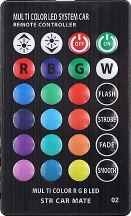

### STR-CAR-MATE

]

ON
---

Encoding: NEC
Code: FC03EF00
rawData[68]:
 -966300
 +9150,-4550
 + 550,- 600 + 550,- 600 + 550,- 550 + 550,- 600
 + 600,- 550 + 600,- 550 + 550,- 600 + 550,- 600
 + 550,-1700 + 550,-1650 + 600,-1650 + 550,-1700
 + 550,- 600 + 550,-1700 + 600,-1650 + 600,-1650
 + 550,-1700 + 550,-1700 + 550,- 600 + 550,- 550
 + 600,- 550 + 600,- 550 + 600,- 550 + 600,- 550
 + 550,- 600 + 550,- 600 + 550,-1650 + 600,-1650
 + 550,-1750 + 550,-1700 + 550,-1700 + 550,-1650
 + 550

---

OFF
---
Encoding: NEC
Code: FD02EF00
rawData[68]:
 -998150
 +9200,-4500
 + 550,- 550 + 600,- 550 + 600,- 550 + 600,- 550
 + 600,- 550 + 600,- 550 + 550,- 550 + 600,- 550
 + 600,-1650 + 600,-1650 + 600,-1650 + 600,-1650
 + 600,- 550 + 600,-1650 + 550,-1700 + 600,-1650
 + 550,- 550 + 600,-1650 + 650,- 500 + 600,- 550
 + 600,- 550 + 600,- 550 + 550,- 550 + 600,- 550
 + 600,-1650 + 600,- 550 + 600,-1650 + 600,-1650
 + 600,-1650 + 550,-1700 + 550,-1700 + 550,-1700
 + 550
---
DOWN
---
Encoding: NEC
Code: FE01EF00
rawData[68]:
 -2132000
 +9200,-4500
 + 550,- 550 + 600,- 550 + 600,- 550 + 550,- 600
 + 550,- 600 + 550,- 600 + 550,- 550 + 600,- 550
 + 550,-1700 + 600,-1650 + 600,-1650 + 600,-1650
 + 550,- 600 + 550,-1700 + 550,-1650 + 600,-1650
 + 600,-1650 + 600,- 550 + 600,- 550 + 550,- 600
 + 550,- 550 + 600,- 550 + 600,- 550 + 600,- 550
 + 600,- 550 + 550,-1700 + 550,-1700 + 550,-1650
 + 600,-1650 + 600,-1650 + 600,-1650 + 600,-1650
 + 600
---
UP
---
Encoding: NEC
Code: FF00EF00
rawData[68]:
 -2160800
 +9150,-4500
 + 600,- 550 + 600,- 550 + 550,- 600 + 550,- 550
 + 600,- 550 + 600,- 550 + 600,- 550 + 550,- 600
 + 550,-1650 + 600,-1650 + 550,-1700 + 600,-1650
 + 600,- 550 + 550,-1700 + 550,-1700 + 550,-1650
 + 600,- 550 + 600,- 550 + 600,- 550 + 550,- 600
 + 550,- 600 + 550,- 550 + 600,- 550 + 550,- 600
 + 600,-1650 + 550,-1700 + 550,-1700 + 550,-1650
 + 600,-1650 + 600,-1650 + 600,-1650 + 600,-1650
 + 550

---
WHITE
---
Encoding: NEC
Code: F807EF00
rawData[68]:
 -3276750
 +9200,-4450
 + 600,- 550 + 600,- 500 + 600,- 550 + 600,- 550
 + 600,- 550 + 600,- 500 + 650,- 500 + 600,- 550
 + 600,-1650 + 600,-1600 + 650,-1600 + 600,-1650
 + 600,- 550 + 600,-1600 + 650,-1600 + 600,-1650
 + 600,-1650 + 550,-1700 + 600,-1600 + 600,- 550
 + 600,- 550 + 600,- 550 + 550,- 550 + 600,- 550
 + 600,- 550 + 600,- 550 + 600,- 500 + 650,-1600
 + 600,-1650 + 600,-1650 + 600,-1650 + 600,-1600
 + 600

---
BLUE
---
Encoding: NEC
Code: F906EF00
rawData[68]:
 -3276750
 +9150,-4450
 + 650,- 500 + 650,- 500 + 600,- 550 + 600,- 550
 + 600,- 500 + 650,- 500 + 600,- 550 + 600,- 550
 + 600,-1650 + 600,-1600 + 650,-1600 + 600,-1650
 + 600,- 550 + 600,-1650 + 600,-1650 + 550,-1650
 + 600,- 550 + 600,-1650 + 600,-1650 + 550,- 600
 + 550,- 600 + 550,- 550 + 600,- 550 + 600,- 550
 + 550,-1700 + 550,- 600 + 550,- 550 + 600,-1650
 + 600,-1650 + 600,-1700 + 550,-1650 + 550,-1700
 + 550

---
GREEN
---
Encoding: NEC
Code: FA05EF00
rawData[68]:
 -1028300
 +9200,-4450
 + 600,- 600 + 600,- 550 + 550,- 550 + 600,- 550
 + 550,- 600 + 600,- 550 + 550,- 600 + 550,- 550
 + 600,-1650 + 600,-1650 + 550,-1700 + 550,-1700
 + 550,- 600 + 550,-1650 + 600,-1650 + 550,-1700
 + 550,-1700 + 550,- 600 + 550,-1650 + 600,- 550
 + 600,- 550 + 550,- 600 + 550,- 600 + 550,- 600
 + 550,- 550 + 600,-1650 + 550,- 600 + 550,-1700
 + 550,-1700 + 550,-1650 + 600,-1650 + 600,-1650
 + 550

---
RED
---
Encoding: NEC
Code: FB04EF00
rawData[68]:
 -3276750
 +9150,-4450
 + 650,- 500 + 600,- 550 + 600,- 550 + 600,- 500
 + 600,- 550 + 600,- 550 + 600,- 500 + 650,- 500
 + 600,-1650 + 600,-1600 + 650,-1600 + 600,-1650
 + 600,- 550 + 600,-1600 + 600,-1650 + 600,-1650
 + 600,- 500 + 600,- 550 + 600,-1650 + 600,- 500
 + 600,- 550 + 600,- 550 + 600,- 500 + 650,- 500
 + 600,-1650 + 600,-1650 + 600,- 500 + 600,-1650
 + 600,-1650 + 600,-1600 + 600,-1650 + 600,-1650
 + 600

---
FLASH
---
Encoding: NEC
Code: F40BEF00
rawData[68]:
 -3276750
 +9150,-4450
 + 600,- 550 + 600,- 550 + 550,- 600 + 550,- 600
 + 550,- 550 + 600,- 550 + 550,- 600 + 550,- 600
 + 550,-1650 + 550,-1700 + 550,-1700 + 550,-1650
 + 550,- 600 + 550,-1700 + 550,-1650 + 550,-1700
 + 550,-1700 + 550,-1650 + 550,- 600 + 550,-1700
 + 550,- 550 + 600,- 550 + 550,- 600 + 550,- 600
 + 550,- 550 + 550,- 600 + 550,-1700 + 550,- 550
 + 550,-1700 + 550,-1700 + 550,-1650 + 600,-1600
 + 600

---
BLUE1
---
Encoding: NEC
Code: F50AEF00
rawData[68]:
 -3276750
 +9100,-4450
 + 600,- 550 + 550,- 600 + 550,- 600 + 550,- 550
 + 550,- 600 + 550,- 600 + 550,- 550 + 600,- 550
 + 550,-1700 + 550,-1650 + 600,-1650 + 550,-1700
 + 550,- 550 + 550,-1700 + 550,-1700 + 550,-1650
 + 600,- 550 + 550,-1650 + 600,- 550 + 550,-1700
 + 550,- 550 + 600,- 550 + 550,- 600 + 550,- 550
 + 600,-1650 + 600,- 550 + 550,-1650 + 600,- 550
 + 600,-1650 + 550,-1650 + 600,-1650 + 600,-1600
 + 600

---
GREEN1
---
Encoding: NEC
Code: F609EF00
rawData[68]:
 -879550
 +9150,-4450
 + 600,- 600 + 550,- 550 + 550,- 600 + 550,- 600
 + 550,- 550 + 600,- 550 + 550,- 600 + 550,- 600
 + 550,-1650 + 550,-1700 + 550,-1700 + 550,-1650
 + 550,- 600 + 550,-1700 + 550,-1650 + 550,-1700
 + 550,-1700 + 550,- 550 + 550,- 600 + 550,-1700
 + 550,- 550 + 600,- 550 + 550,- 600 + 550,- 600
 + 550,- 550 + 550,-1700 + 550,-1700 + 550,- 550
 + 600,-1650 + 550,-1700 + 550,-1650 + 600,-1650
 + 550

---
RED1
---
Encoding: NEC
Code: F708EF00
rawData[68]:
 -3276750
 +9100,-4450
 + 600,- 600 + 550,- 550 + 550,- 600 + 550,- 600
 + 550,- 550 + 600,- 550 + 550,- 600 + 550,- 550
 + 550,-1700 + 550,-1700 + 550,-1650 + 550,-1700
 + 550,- 600 + 550,-1650 + 550,-1700 + 550,-1650
 + 550,- 600 + 550,- 600 + 550,- 550 + 550,-1700
 + 550,- 600 + 550,- 550 + 550,- 600 + 550,- 600
 + 550,-1650 + 550,-1700 + 550,-1650 + 600,- 550
 + 550,-1650 + 600,-1600 + 650,-1600 + 600,-1600
 + 650

---
STROBE
---
Encoding: NEC
Code: F00FEF00
rawData[68]:
 -3276750
 +9150,-4500
 + 600,- 550 + 550,- 600 + 550,- 600 + 550,- 550
 + 600,- 550 + 550,- 600 + 550,- 600 + 550,- 600
 + 550,-1650 + 600,-1650 + 550,-1700 + 550,-1700
 + 550,- 600 + 550,-1650 + 600,-1650 + 550,-1700
 + 550,-1700 + 500,-1700 + 600,-1650 + 550,-1700
 + 550,- 600 + 550,- 600 + 550,- 550 + 600,- 550
 + 550,- 600 + 550,- 600 + 550,- 550 + 600,- 550
 + 550,-1700 + 550,-1700 + 550,-1650 + 600,-1650
 + 600

---
BLUE2
---
Encoding: NEC
Code: F10EEF00
rawData[68]:
 -3276750
 +9100,-4550
 + 550,- 550 + 600,- 550 + 600,- 550 + 600,- 550
 + 550,- 600 + 550,- 600 + 550,- 600 + 550,- 600
 + 550,-1650 + 600,-1650 + 600,-1700 + 550,-1650
 + 550,- 600 + 550,-1750 + 550,-1650 + 550,-1700
 + 550,- 600 + 550,-1700 + 550,-1700 + 550,-1700
 + 550,- 550 + 600,- 600 + 500,- 600 + 600,- 550
 + 550,-1700 + 550,- 600 + 550,- 600 + 550,- 550
 + 600,-1650 + 600,-1650 + 600,-1650 + 550,-1700
 + 550

---
GREEN2
---
Encoding: NEC
Code: F20DEF00
rawData[68]:
 -3276750
 +9200,-4450
 + 650,- 500 + 600,- 550 + 600,- 550 + 600,- 550
 + 600,- 500 + 650,- 500 + 650,- 500 + 600,- 550
 + 600,-1650 + 600,-1650 + 600,-1650 + 600,-1600
 + 650,- 500 + 600,-1650 + 600,-1650 + 600,-1650
 + 600,-1650 + 600,- 500 + 650,-1600 + 650,-1600
 + 650,- 500 + 650,- 500 + 650,- 500 + 650,- 500
 + 600,- 550 + 600,-1650 + 600,- 550 + 600,- 550
 + 600,-1650 + 600,-1650 + 600,-1650 + 600,-1650
 + 550

---
RED2
---
Encoding: NEC
Code: F30CEF00
rawData[68]:
 -3276750
 +9150,-4450
 + 600,- 600 + 550,- 550 + 550,- 600 + 550,- 600
 + 550,- 600 + 550,- 550 + 550,- 600 + 550,- 600
 + 550,-1650 + 600,-1650 + 550,-1700 + 550,-1650
 + 600,- 550 + 600,-1650 + 550,-1650 + 600,-1650
 + 600,- 550 + 550,- 550 + 600,-1650 + 600,-1650
 + 600,- 550 + 600,- 500 + 600,- 550 + 600,- 550
 + 600,-1650 + 600,-1600 + 600,- 550 + 600,- 550
 + 600,-1600 + 650,-1600 + 600,-1650 + 600,-1650
 + 600

---
FADE
---
Encoding: NEC
Code: EC13EF00
rawData[68]:
 -3276750
 +9200,-4450
 + 600,- 600 + 550,- 550 + 600,- 550 + 600,- 550
 + 600,- 550 + 550,- 600 + 550,- 550 + 600,- 550
 + 550,-1700 + 600,-1600 + 650,-1600 + 650,-1600
 + 600,- 550 + 600,-1650 + 600,-1650 + 600,-1650
 + 600,-1650 + 600,-1600 + 650,- 500 + 600,- 600
 + 550,-1650 + 600,- 550 + 600,- 550 + 600,- 550
 + 550,- 600 + 550,- 600 + 600,-1600 + 600,-1650
 + 600,- 550 + 600,-1650 + 600,-1650 + 600,-1650
 + 600

---
BLUE3
---
Encoding: NEC
Code: ED12EF00
rawData[68]:
 -3276750
 +9300,-4450
 + 650,- 550 + 600,- 550 + 550,- 600 + 600,- 500
 + 650,- 550 + 600,- 550 + 600,- 550 + 600,- 550
 + 600,-1650 + 600,-1650 + 600,-1650 + 600,-1650
 + 600,- 550 + 600,-1650 + 600,-1650 + 600,-1700
 + 600,- 550 + 550,-1700 + 600,- 550 + 550,- 550
 + 600,-1650 + 650,- 550 + 600,- 550 + 600,- 550
 + 600,-1600 + 650,- 550 + 600,-1600 + 650,-1600
 + 650,- 550 + 600,-1600 + 650,-1600 + 650,-1600
 + 650

---
GREEN3
---

Encoding: NEC
Code: EE11EF00
rawData[68]:
 -3276750
 +9100,-4500
 + 550,- 600 + 600,- 550 + 550,- 600 + 550,- 550
 + 600,- 550 + 600,- 550 + 550,- 600 + 550,- 550
 + 600,-1650 + 600,-1650 + 550,-1700 + 550,-1700
 + 550,- 550 + 600,-1650 + 600,-1650 + 600,-1650
 + 600,-1650 + 550,- 600 + 550,- 550 + 600,- 550
 + 600,-1650 + 600,- 550 + 550,- 600 + 550,- 550
 + 600,- 550 + 600,-1650 + 600,-1650 + 550,-1700
 + 550,- 600 + 550,-1650 + 600,-1650 + 600,-1650
 + 600

---

RED3
---

Encoding: NEC
Code: EF10EF00
rawData[68]:
 -3276750
 +9150,-4450
 + 600,- 550 + 600,- 550 + 600,- 550 + 550,- 550
 + 600,- 550 + 600,- 550 + 600,- 550 + 550,- 550
 + 600,-1650 + 600,-1650 + 600,-1650 + 550,-1700
 + 550,- 550 + 600,-1650 + 600,-1650 + 600,-1650
 + 600,- 550 + 550,- 550 + 600,- 550 + 550,- 600
 + 600,-1650 + 550,- 600 + 550,- 550 + 600,- 550
 + 600,-1650 + 600,-1650 + 550,-1700 + 550,-1650
 + 600,- 550 + 600,-1650 + 600,-1650 + 550,-1700
 + 550

---

SMOOTH
---

Encoding: NEC
Code: E817EF00
rawData[68]:
 -3276750
 +9150,-4500
 + 550,- 600 + 550,- 600 + 500,- 650 + 500,- 600
 + 550,- 600 + 550,- 600 + 550,- 600 + 500,- 650
 + 550,-1650 + 550,-1700 + 550,-1700 + 500,-1750
 + 500,- 650 + 550,-1650 + 550,-1700 + 550,-1700
 + 500,-1750 + 550,-1650 + 550,-1700 + 550,- 600
 + 550,-1700 + 550,- 600 + 500,- 650 + 500,- 650
 + 500,- 600 + 550,- 600 + 550,- 600 + 500,-1750
 + 500,- 650 + 500,-1700 + 550,-1700 + 550,-1700
 + 550

---

BLUE4
---

Encoding: NEC
Code: E916EF00
rawData[68]:
 -3276750
 +9200,-4500
 + 600,- 550 + 550,- 600 + 550,- 550 + 600,- 550
 + 600,- 550 + 600,- 550 + 600,- 550 + 600,- 550
 + 550,-1700 + 550,-1700 + 550,-1650 + 600,-1650
 + 600,- 550 + 600,-1650 + 600,-1650 + 600,-1650
 + 600,- 550 + 600,-1650 + 600,-1650 + 600,- 450
 + 650,-1700 + 550,- 600 + 550,- 600 + 550,- 550
 + 600,-1650 + 600,- 550 + 600,- 550 + 600,-1650
 + 600,- 550 + 600,-1650 + 600,-1650 + 600,-1650
 + 600

---

GREEN4
---

Encoding: NEC
Code: EA15EF00
rawData[68]:
 -3276750
 +9150,-4500
 + 550,- 600 + 550,- 550 + 550,- 600 + 550,- 600
 + 600,- 550 + 550,- 600 + 550,- 600 + 500,- 600
 + 600,-1650 + 550,-1700 + 600,-1650 + 550,-1750
 + 500,- 650 + 550,-1650 + 600,-1650 + 600,-1650
 + 600,-1650 + 600,- 550 + 550,-1700 + 600,- 550
 + 600,-1650 + 600,- 550 + 550,- 600 + 550,- 600
 + 550,- 600 + 550,-1700 + 550,- 600 + 550,-1650
 + 600,-

---

RED4
---

Encoding: NEC
Code: EB14EF00
rawData[68]:
 -3276750
 +9150,-4500
 + 550,- 600 + 600,- 550 + 600,- 550 + 550,- 600
 + 550,- 550 + 600,- 550 + 600,- 550 + 550,- 600
 + 550,-1700 + 550,-1650 + 600,-1650 + 600,-1650
 + 600,- 550 + 550,-1700 + 550,-1700 + 550,-1650
 + 600,- 550 + 600,- 550 + 600,-1650 + 550,- 600
 + 550,-1700 + 550,- 550 + 600,- 550 + 600,- 550
 + 600,-1650 + 550,-1700 + 550,- 600 + 550,-1650
 + 600,- 550 + 600,-1650 + 600,-1650 + 550,-1700
 + 550

---
